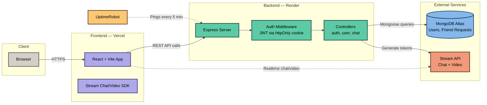
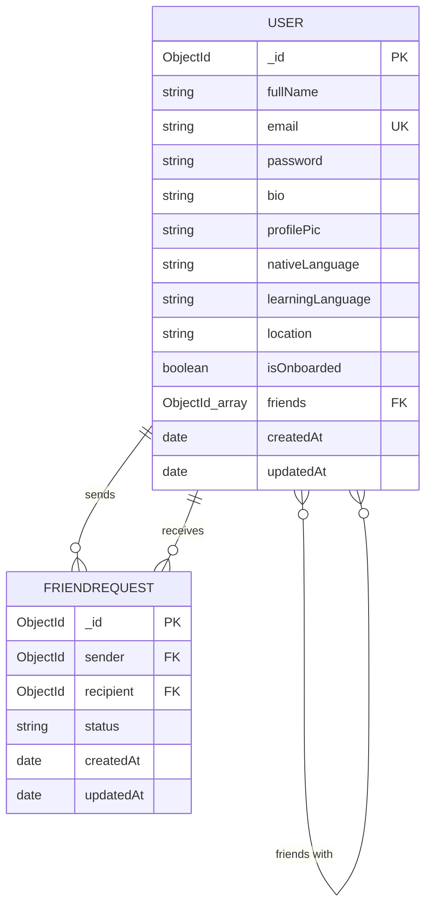
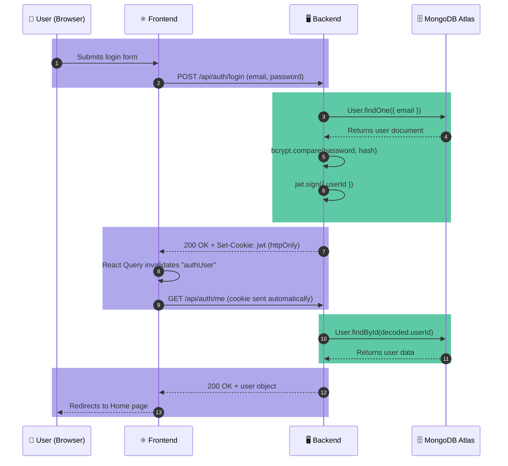
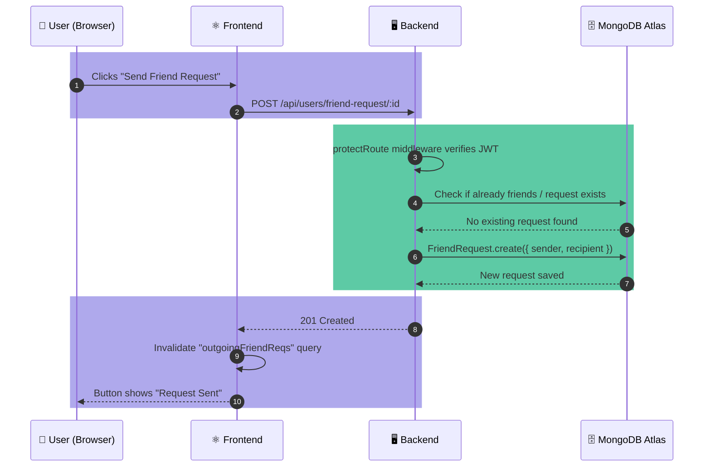
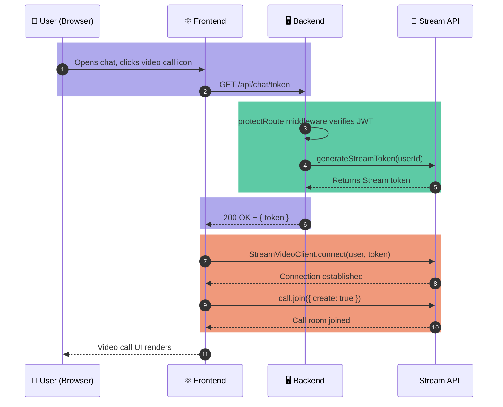

# BhashaShikho — Architecture & Request Flow

This document visualizes how requests move through the system. Both diagrams below use [Mermaid](https://mermaid.js.org/) syntax, which GitHub renders automatically — no image upload needed.

---

## 1. System Architecture

High-level view of how the pieces are connected and hosted.

---

## 2. Database Schema

Entity relationship diagram based on the `User` and `FriendRequest` Mongoose models.

**Notes:**
- `USER.friends` stores an array of `ObjectId` references back to other `USER` documents — this is what powers the many-to-many "friends with" relationship.
- `FRIENDREQUEST.status` is an enum: `"pending"` or `"accepted"`. There is no separate `"rejected"` state — a declined request is simply left as `"pending"` or removed.
- `FRIENDREQUEST.sender` and `.recipient` both reference `USER._id`, which is why the diagram shows two relationships (`sends` and `receives`) between the same two entities.
- `email` is unique (`UK`) and enforced at the schema level via Mongoose's `unique: true`.

---

## 3. Request Flow — Login

Step-by-step path of a single login request, from click to response.

---

## 4. Request Flow — Sending a Friend Request

---

## 5. Request Flow — Starting a Video Call

