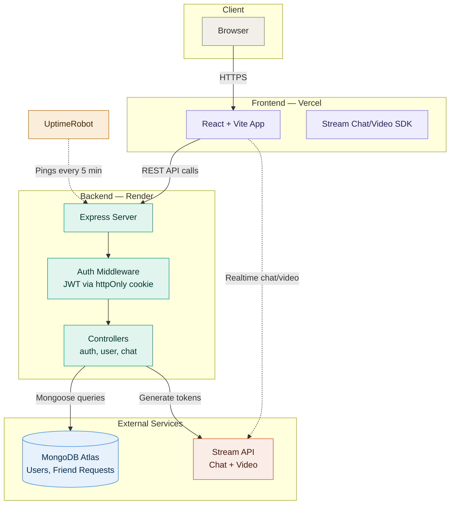
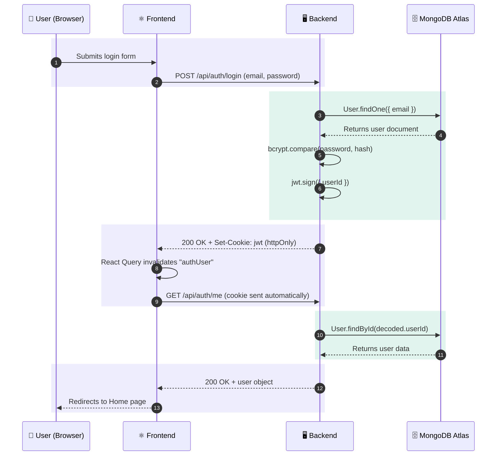
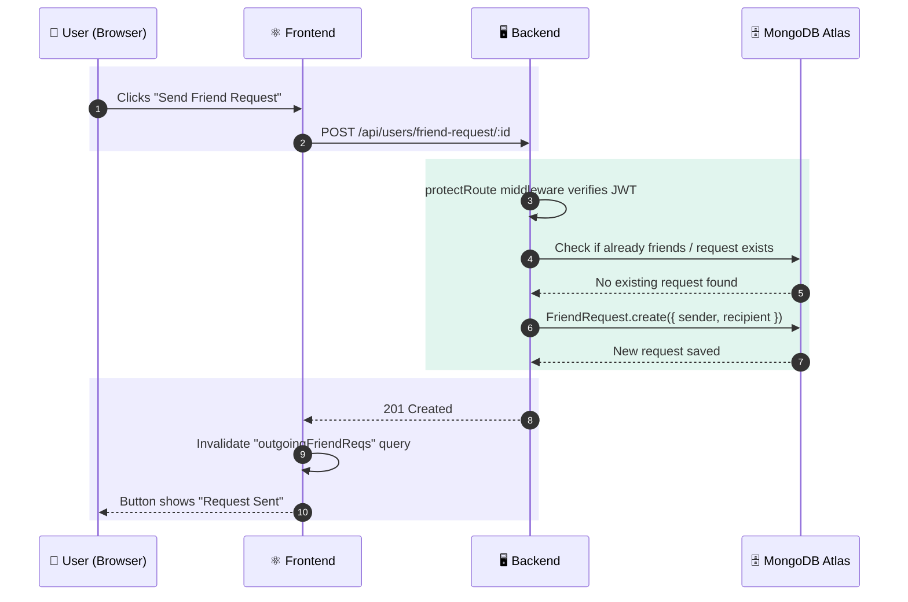
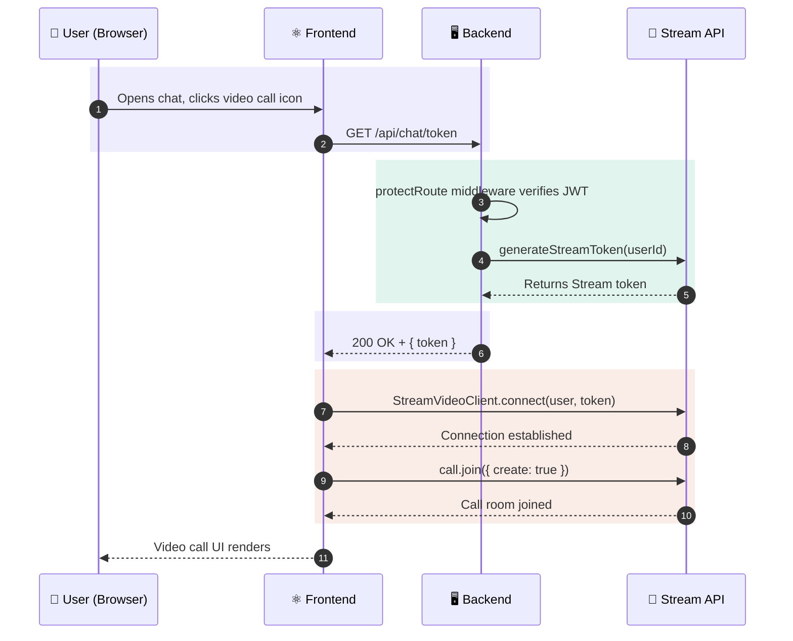

# BhashaShikho — Architecture & Request Flow

This document visualizes how requests move through the system. Both diagrams below use [Mermaid](https://mermaid.js.org/) syntax, which GitHub renders automatically — no image upload needed.

---

## 1. System Architecture

High-level view of how the pieces are connected and hosted.

---

## 2. Request Flow — Login

Step-by-step path of a single login request, from click to response.

---

## 3. Request Flow — Sending a Friend Request

---

## 4. Request Flow — Starting a Video Call

